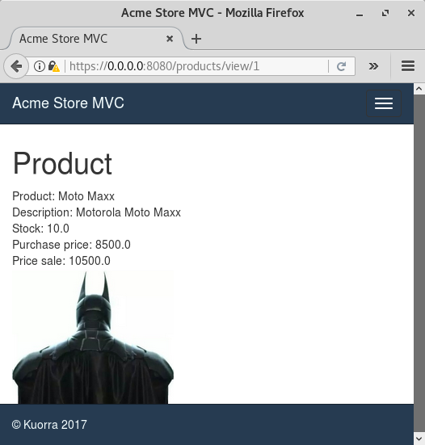
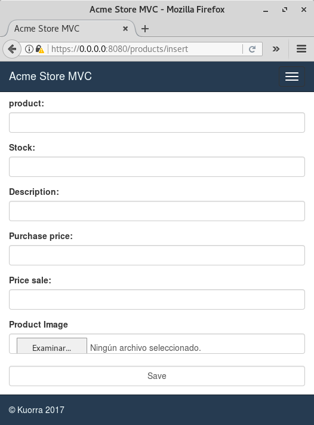
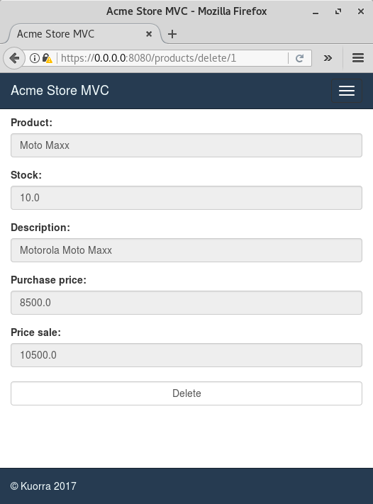

kuorra
======

Introduction
------------

Kuorra is a WebApp Model, it's based on MVC Pattern, and use Web.py like
Microframework.

Use Kuorra to create a MVC skeleton for work with Web.py, MySQL and
Heroku App.

--------------

Kuorra Model
------------

.. figure:: images/kuorra.svg
   :alt: Kuorra model

   Alt text

--------------

Install Kuorra
--------------

-  In a terminal write **python -m pip install kuorra**, this download
   all requirements packages.

.. figure:: images/install_kuorra.png
   :alt: Kuorra model

   Alt text

-  When finish you can use kuorra

.. figure:: images/kuorra_installed.png
   :alt: Kuorra model

   Alt text

--------------

Upgrade Kuorra
--------------

-  In a terminal write **python -m pip install kuorra ---upgrade**, this
   update all requirements packages.

.. figure:: images/kuorra_upgrade.png
   :alt: Kuorra model

   Alt text

--------------

Functions
---------

-  Script for create a demo DB.

-  Config one DB conection.

-  Create a products **Controller**.

-  *Index* **[index.py]**
-  *View* **[view.py]**
-  *Edit* **[edit.py]**
-  *Delete* **[delete.py]**
-  *Insert* **[insert.py]**

-  Create a products **Model**. **[model\_products.py]**

-  *get\_all\_products*
-  *get\_products*
-  *delete\_products*
-  *insert\_products*
-  *edit\_products*

-  Create a products **Views**:

-  *Index* **[index.html]**
-  *View* **[view.html]**
-  *Edit* **[edit.html]**
-  *Delete* **[delete.html]**
-  *Insert* **[insert.html]**
-  *Master* **[master.html]** Web Template

-  Create a products **API**. **[api\_products.py]**

-  *GET all products* (GET)
-  *GET one product* (GET id)
-  *INSERT one product* (PUT id, fields)
-  *DELETE one product* (DELETE id)
-  *UPDATE one product* (UPDATE id, fields)

7. Active a SSL connection

--------------

How to Use Kuorra
=================

Create new project
------------------

**kuorra new project\_name**

.. figure:: images/kuorra_new.png?raw=true
   :alt: kuorra new

   Alt text

-  Acme Store MVC Skeleton

.. figure:: images/vs_code.png?raw=true
   :alt: vs code

   Alt text

--------------

Config new project
------------------

-  The new project have a demo database called **acme\_store\_mvc**,
   with a products table.

-  The database script is written in the file **data + schema.sql**.

.. figure:: images/schme.png?raw=true
   :alt: schema

   Alt text

-  Connect to MySQL server using *mysql cli*, *mysql workbench* or any
   other application.

.. figure:: images/mysql_0.png?raw=true
   :alt: mysql cli

   Alt text

-  Execute the script **schema.sql** for create the DB.

.. figure:: images/mysql_1.png?raw=true
   :alt: source schema.sql

   Alt text

-  Products table

.. figure:: images/products.png?raw=true
   :alt: Products table

   Alt text

-  In the file **application + models + model\_products.py** modify the
   connection parameters

-  **db\_host** = 'localhost'
-  **db\_name** = 'acme\_store\_mvc'
-  **db\_user** = 'your user name'
-  **db\_pw** = 'your password'

.. figure:: images/config.png?raw=true
   :alt: Config

   Alt text

--------------

Deploy project
--------------

-  Into de folder where is the **app.py** file execute **kuorra dep**
   for deploy de WebApp.

**kuorra dep**

.. figure:: images/kuorra_dep.png?raw=true
   :alt: kuorra dep

   Alt text

-  For stop de server press **Ctrl + C**.

.. figure:: images/kuorra_stop.png
   :alt: Stop

   Alt text

--------------

Acme store Demo
---------------

-  https://localhost:8080/

.. figure:: images/kuorra_index.png
   :alt: index.html

   Alt text

--------------

-  https://localhost:8080/products/view/1

   Alt text

--------------

-  https://localhost:8080/products/insert

   Alt text

--------------

-  https://localhost:8080/products/delete/1

   Alt text

--------------

-  https://localhost:8080/products/edit/1

   Alt text

--------------

Author Salvador Hernández Mendoza
'''''''''''''''''''''''''''''''''

Email salvadorhm@gmail.com
''''''''''''''''''''''''''

Twitter @salvadorhm
'''''''''''''''''''

