* Crear un proyecto en Kuorra

Después de realizar la instalación y configuración de kuorra y de algún servidor de bases de datos relacional como Mariadb o MySQL se puede comenzar a crear proyectos con kuorra.

A continuación se muestran los pasos para este proceso:

1. Verificar si kuorra esta completamente configurado, para hacer esto hay que abrir una terminal o línea de comandos (cmd) y ejecutar el siguiente comando:

'''
kuorra -i
'''

Este comando muestra la información de la versión de kuorra instalada y los comando necesarios para trabajar, tal como se muestra en la Imagen 1, al momento de escribir este tutorial la versión utilizada es la 0.7.2.2.

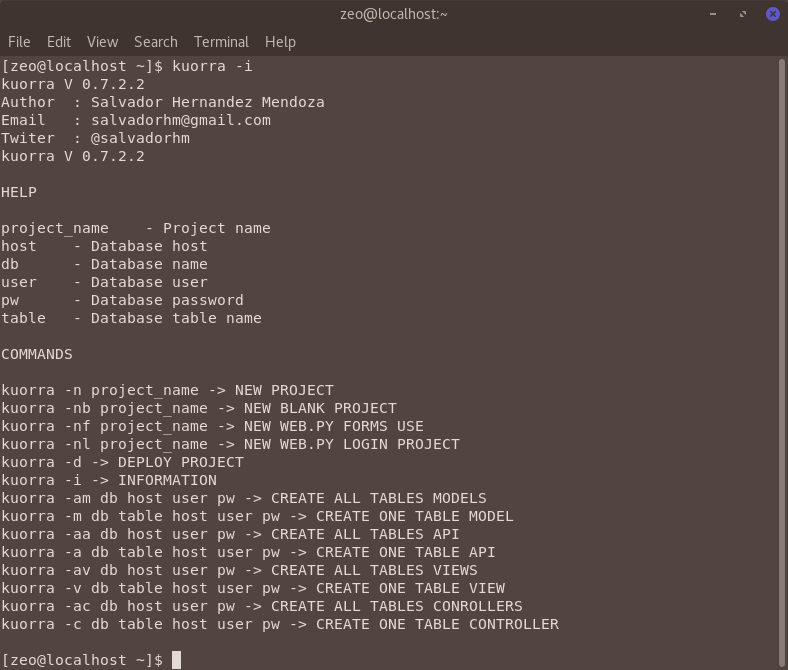

2. Para crear un nuevo proyecto hay que abrir una terminal en la carpeta donde se va crear el proyecto, por ejemplo en la carpeta "Mis Documentos” o “Documentos", y ejecutar el siguiente comando, tal como se muestra en la Imagen 2:

'''
kuorra -nl nombre_proyecto
'''

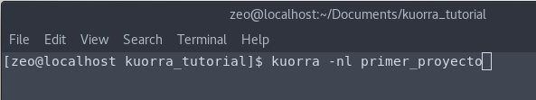

3. Al ejecutar este comando si todo esta bien configurado se creará el proyecto nuevo y se muestra el resultado en la terminal, como se puede ver en la Imagen 3:

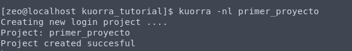

4. Al mostrar la lista de archivos o directorios con el comando ls en linux o dir en windows se debe ver una carpeta con el nombre del proyecto, Imagen 4.

5. A continuación se puede abrir la carpeta creada con un editor o IDE para comenzar a trabajar con el proyecto, pueden servir Visual Studio Code, Atom, SublimeText, PyCharm, NinjaIDE, Spyder, o si se quiere trabajar desde consola o terminal NiceEditor (ne). 

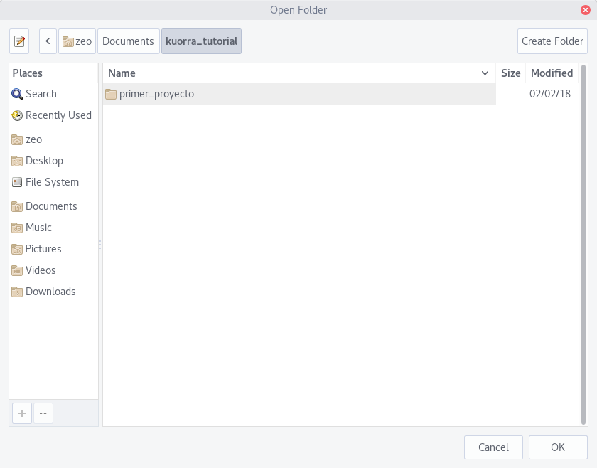

6. En la imagen 7 se puede ver la estructura del proyecto que se acaba de crear, teniendo como archivo principal para ejecutar el proyecto a app.py.  

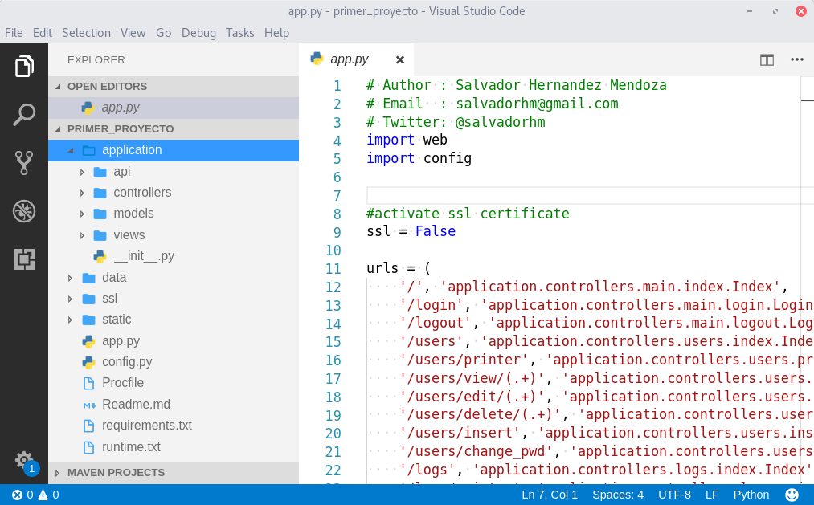

7. Dentro de la carpeta data hay un archivo de nombre schema.sql, este archivo contiene un script de sql que permite crear una base de datos nueva llamada kuorra_login, además de crear un usuario de base de datos de nombre kuorra con la contraseña kuorra.2018, esto con fines de seguridad, ya que no será necesario usar el usuario root para trabajar con el nuevo proyecto. (Nota: este usuario y contraseña se puede cambiar, y se verá como en los siguientes tutoriales)

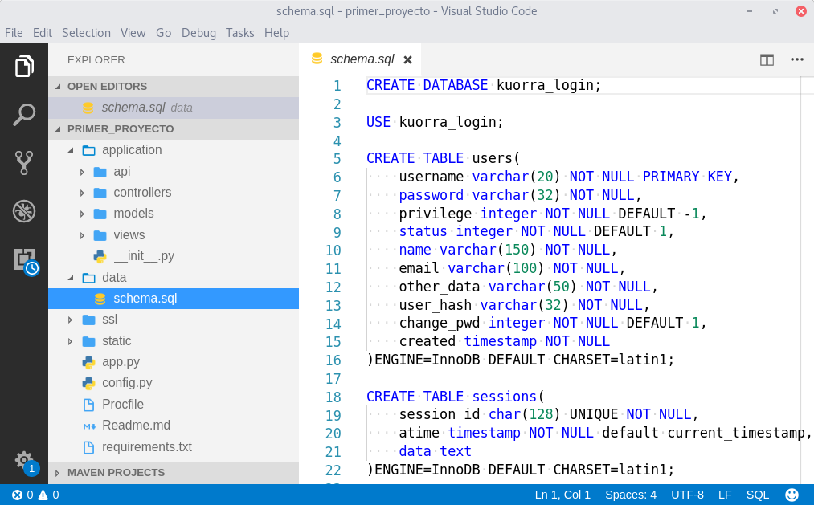

8. Para crear la base de datos para el proyecto se pueden utilizar diferentes herramientas como MySQL Workbench, Heidy o desde terminal, a continuación se muestran dos formas.

* MySQL WorkBench

    Para poder trabajar con el servidor de base de datos MySQL o MariaDB se debe crear una nueva conexión utilizando el usuario root y su contraseña.

    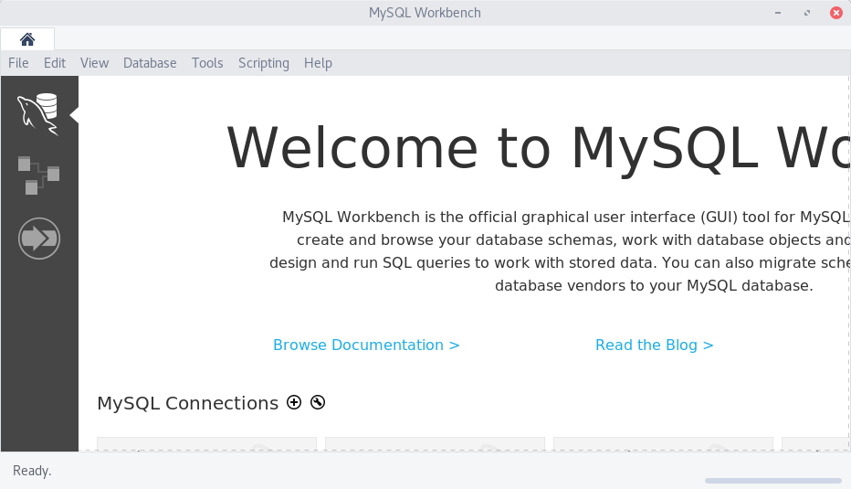

    1. En workbench hay que hacer clic en el simbolo + para configurar una nueva conexión, esto abrirá un panel como se muestra en la Imagen 10, donde se debe dar un nombre a la conexión, la dirección del servidor (si es local se usa 127.0.0.1, si fuera remoto se coloca la url del servidor), el usuario, es este root, y a contraseña del servidor. 

    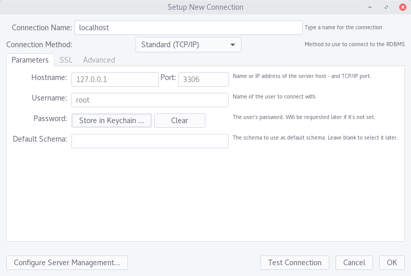

    Nota: Si no hubiera conexión o mostrará un mensaje de error, un buen punto de partida para solucionarlo es verificar si el servidor de base de estas esta funcionando y de no ser así iniciarlo, como se muestra en la Imagen 11.

    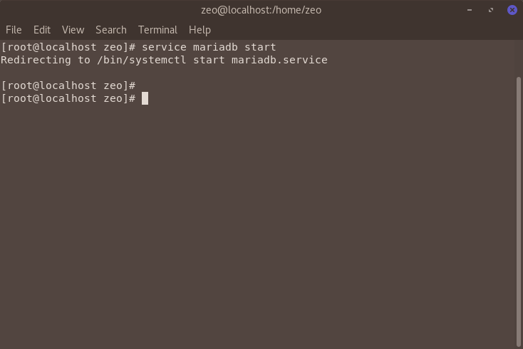

    2. Después de crear la conexión se copia el código del archivo schema.sql en una ventana de query y se ejecuta, como se muestra en la Imagen 12.

    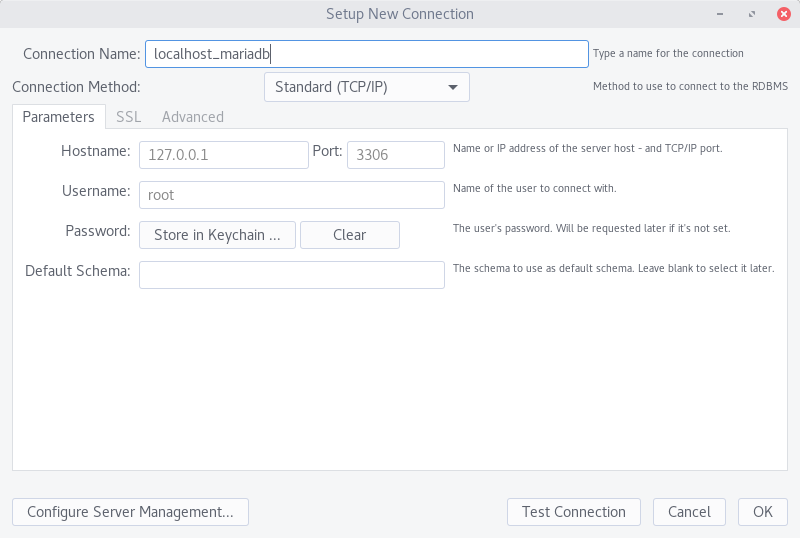

    3. En la Imagen 13 se puede ver que la base fué creada con éxito y al hacer una consulta a la tabla de users esta ya contiene dos usuarios, admin y contraseña admin (A la contraseña se le genero un HASH como medida de protección) y guess con contraseña guess.

    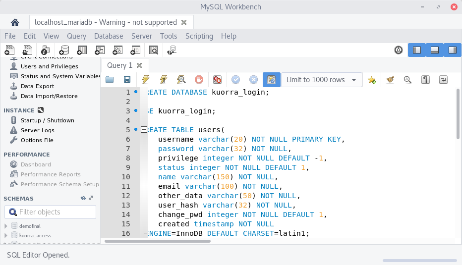

* MariaDB desde la terminal.

    1. Otra forma de crear la base de datos y la estructura es mediante la terminal, para esto hay que ubicarse dentro de la carpeta data.

    Ejecutar el siguiente comando que permite conectarse con la base de datos MySQL o MariaDB de forma indistinta.

    '''
    mysql -u root -p
    '''

    Este comando solicitará la contraseña del usuario root y una vez que se valida el usuario y la contraseña muestra el MariDB monitor o MySQL monitor, como se muestra en la Imagen 14.

    Para importar el script de la base de datos se utiliza el siguiente comando:

    '''
    source schema.sql
    '''

    En la Imagen 15 se puede ver el resultado de importar el script de forma exitosa.

    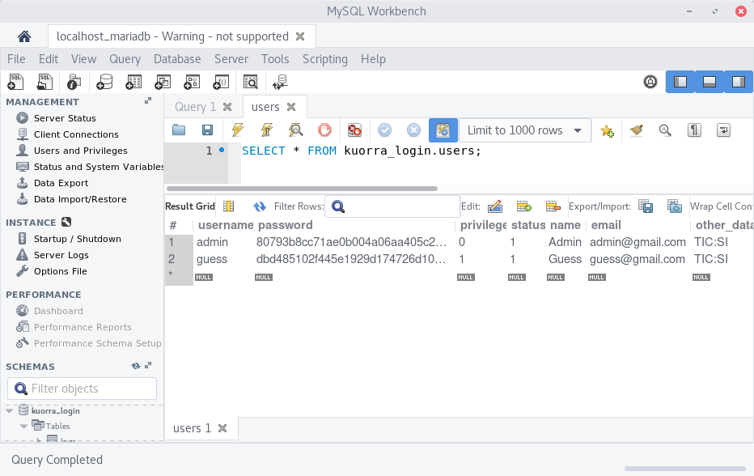

    

9. Una vez que se haya generado la base de datos correctamente se puede ejecutar el proyecto, hay dos forma de hacerlo, la primera es como se muestra en la Imagen 16, usando el siguiente comando:

'''
kuorra -d
'''

En la Imagen 17 se muestra el mensaje de ejecución de kuorra.

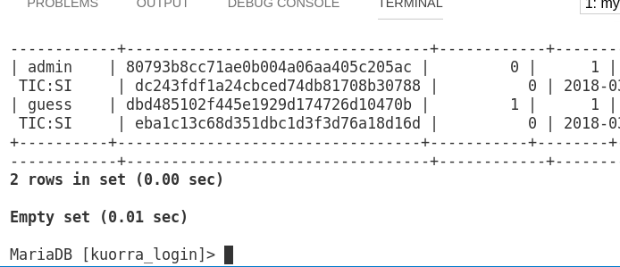

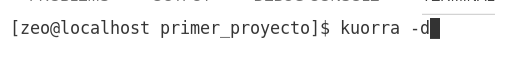

10. La otra forma de ejecutar el proyecto es ejecutando el archivo principal app.py como se muestra en la Imagen 18.

'''
python app.py
'''

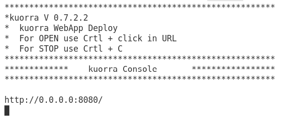

11. Una vez que el proyecto esta funcionando hay que abrir un navegador y colocar la siguiente URL.

http://localhost:8080

O

http://127.0.0.1:8080

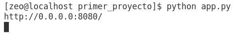

12. En el menú de login se puede ingresar al sistema con cualquier de los dos usuarios creados default.

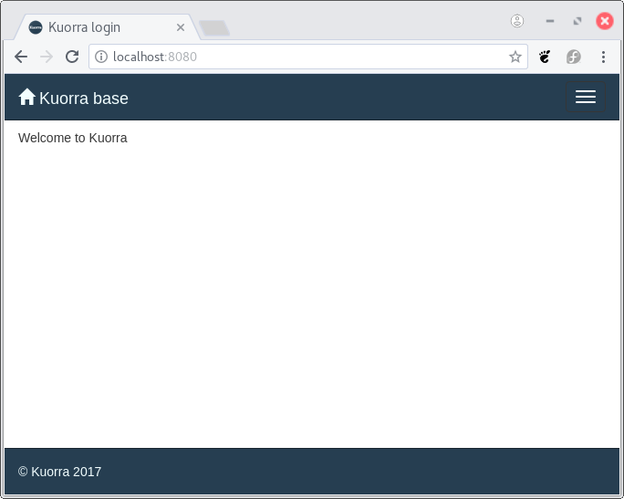

'''
Username: admin
Password: admin
'''

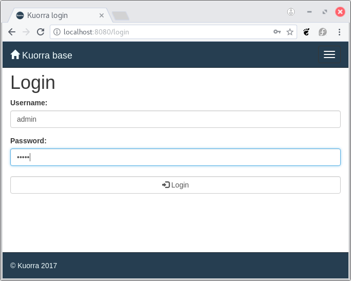

'''
Username: guess
Password: guess
'''

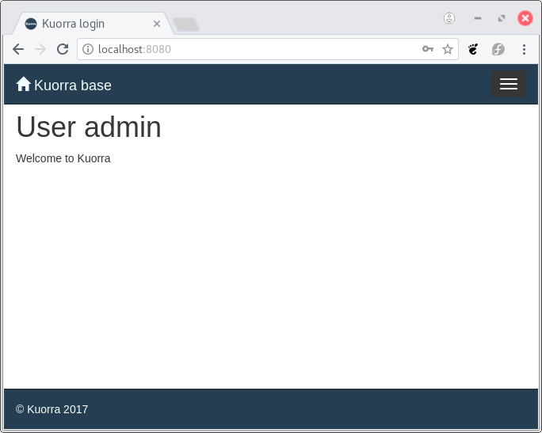

13. En la terminal donde esta corriendo la WebApp se muestran las solicitudes que esta recibiendo el sistema web, como es ve en la Imagen 23.

14. Para detener la ejecución del servidor se utilza la combinación de teclas Ctrl + C.

***

[Anterior](https://salvadorhm.github.io/kuorra/01) | [Siguiente](https://salvadorhm.github.io/kuorra/k03)
