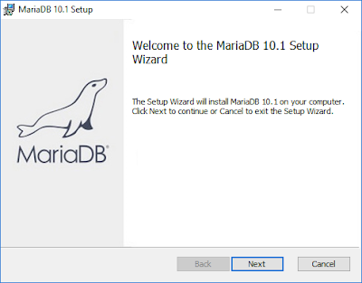
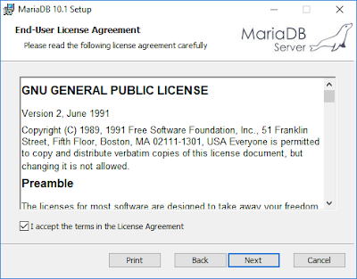
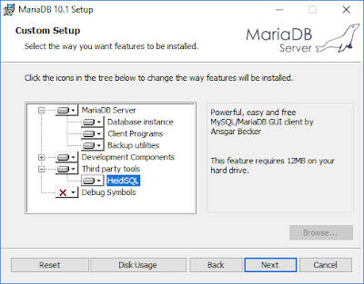
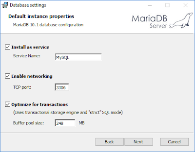
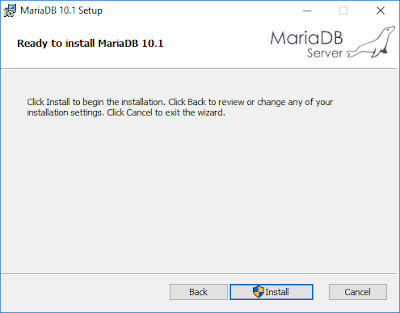
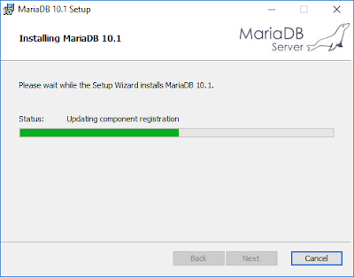
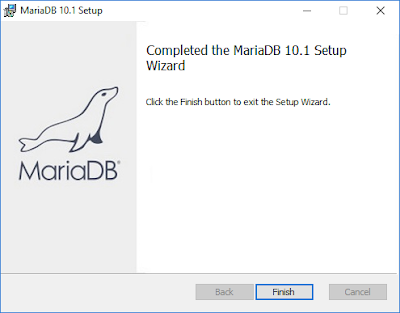

* k03 - Instalación y configuración de MariaDB

MariaDB Existen diferentes herramientas para gestionar BD relacionales, como por ejemplo MySQL, MariaDB, SQLServer, PostgresSQL, entre otras, para trabajar con Kuorra se recomienda MariaDB basado en MySQL y completamente compatible.

1. El primer paso es descargar la versión que corresponda al sistema operativo que se desea utilizar, en este ejemplo se utilizará la versión para Windows de 32 bits, para esto hay que ir la siguiente página de descarga de MariaDB http://mariadb.org, posteriormente se ejecuta el asistente como se muestra en la Imagen 1.

2. Al comenzar la instalación se muestra el asistente con la licencia de uso, para iniciar la configuración hay que aceptar la licencia como se muestra el la Imagen 2.

3. El asistente permite seleccionar los elementos que se desean instalar, esto incluye a HeidiSQL (Ver Imagen 3), una herramienta visual para administrar bases de datos relacionales, puede administrar usuarios, bases de datos, tablas, importar y exportar datos, etc. Es muy recomendable su instalación, aunque puede ser sustituida por herramientas como MySQL Workbench, PHPMyAdmin, o directamente desde consola.

4. El siguiente paso de la configuración es configurar la contraseña del super usuario root, lo cual se recomienda para garantizar el acceso seguro al servidor, posteriormente se pueden crear usuarios con privilegios únicos para cada base de datos, lo que permitirá mantener la seguridad en la base de datos. Véase la Imagen 4.

  
5. En la Imagen 5 se muestra la configuración del servicio, si se activa aparecerá el servicio MySQL siempre activo, además se puede cambiar el puerto a través del cual se realizar la conexión al servidor, default es el 3306.

6. En la Imagen 6 se muestra la opción de enviar Feedback para reportar fallas sobre MariaDB a los desarrolladores, esta función es opcional.

7. Después de realizar la configuración de MariaDB el último paso es aceptar y el instalador comienza con la instalación, tal como se muestra en las Imágenes 7 y 8.

8. En la Imagen 9 se muestra la instalación exitosa de MariaDB.

